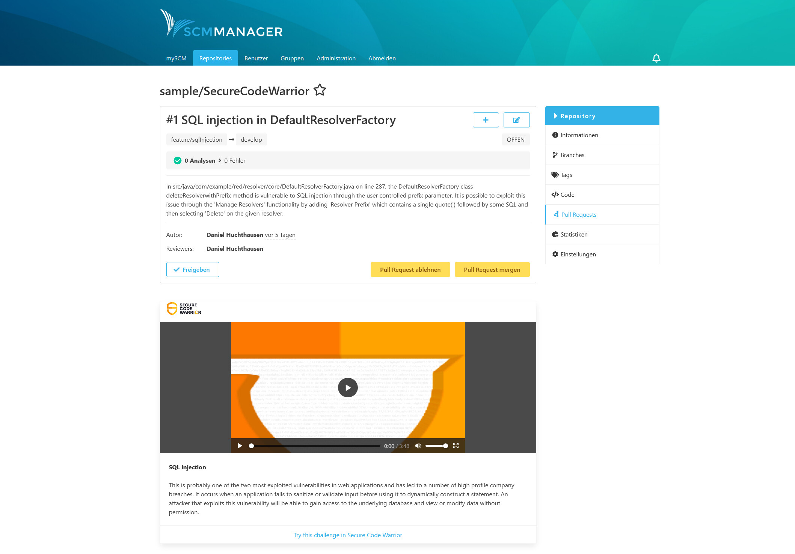
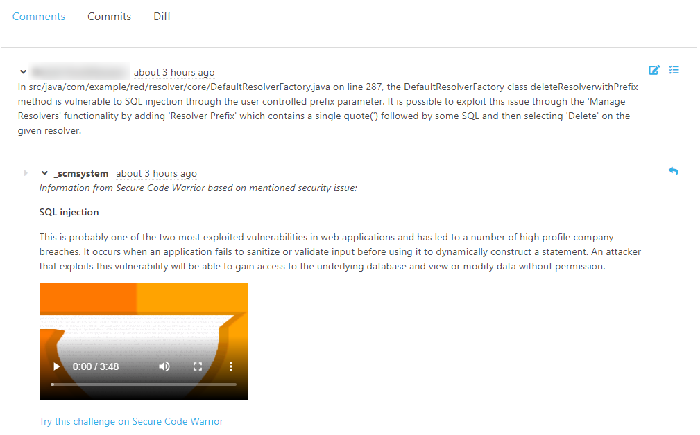
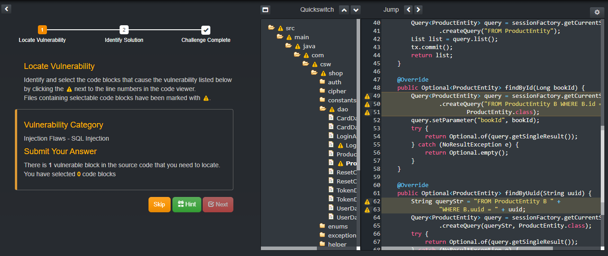

Sobald das Plugin installiert ist, kann es Videos und zusätzliche Informationen zu Sicherheitsthemen zeigen. Sie können es auf zwei verschiedene Arten nutzen:

* Erwähnung von Schlüsselwörtern zu Sicherheitsproblemen in der Beschreibung von Pull-Requests oder
* Erwähnung von Sicherheitsproblemen als Reviewer eines Pull Requests.

### Verwendung in Beschreibungen von Pull Requests

Wenn Sie wissen, dass Ihre Anwendung für ein bestimmtes Sicherheitsproblem anfällig ist, können Sie einen Pull Request erstellen, um das Problem zu beheben. 
In der Beschreibung müssen Sie nur den Namen der Sicherheitslücke erwähnen. Sobald der PR erstellt ist, enthält er auch ein Video, einige Details und einen Link zu weiteren Informationen über das Problem.

Mit all diesen Informationen hat jeder Entwickler alles, was er braucht, um an dem Problem zu arbeiten.

### Verwendung in Pull-Request-Kommentaren

Ein anderes Szenario ist, dass ein Reviewer eines Pull-Requests eine Schwachstelle findet oder vermutet und einen Kommentar in den Pull-Request schreibt. 
Dann liefert das Plugin die Details in einem zusätzlichen Kommentar.

Auf diese Weise erhält der Entwickler alle Informationen, die er benötigt, um das Problem zu beheben, damit der Pull-Request akzeptiert werden kann.

### Challenges

Um ein besseres Verständnis für das jeweilige Thema zu bekommen, gibt es immer auch einen Link zu Challenges direkt unter dem Video und der Beschreibung des Sicherheitsthemas. 
Dieser führt zu Challenges auf der Secure Code Warrior-Website. Sie bieten ein praktisches Beispiel für eine Beispielanwendung.

### Verfügbare Themen

Um festzustellen, welche Sicherheitsprobleme angezeigt werden, verwendet das Plugin eine Liste von Schlüsselwörtern. 
Wann immer eine PR-Beschreibung oder der Inhalt eines Kommentars mit einem der Wörter übereinstimmt, wird die entsprechende Information angezeigt. 
Wenn Schlüsselwörter für mehr als ein Thema übereinstimmen, werden mehrere Videos, Details und Links angezeigt.

Nur um Ihnen zu zeigen, wie viele Themen abgedeckt werden, schauen Sie sich dies an:

* Unsichere Datenspeicherung
* Sensible Datenspeicherung
* Server-seitige Anfragefälschung
* Fremde Funktionalitäten
* Code-Manipulationen
* Client-Code-Qualität
* Unsachgemäße Nutzung der Plattform
* Fehlende binäre Schutzmechanismen
* Unzureichender Schutz der Transportschicht
* Client-seitige Injektion
* Kaputte Kryptographie
* Anfällige Komponenten
* Unzureichende Protokollierung und Überwachung
* Schwachstelle im Seitenkanal
* Offenlegung von Informationen
* Unbeabsichtigtes Datenleck
* Ungültige Umleitungen und Weiterleitungen
* Speicherbeschädigung
* Injection Flaws
* File Upload Vulnerability
* Denial of Service (DoS)
* Unsichere Autorisierung
* Unsichere Authentifizierung
* Unsachgemäße Sitzungsbehandlung
* Sitzungsbehandlung
* Cross-Site Request Forgery
* Authentifizierung
* Fehlkonfiguration der Sicherheit
* Unsichere Kryptografie
* Geschäftslogik
* Cross-Site Scripting (XSS)
* Zugriffskontrolle
