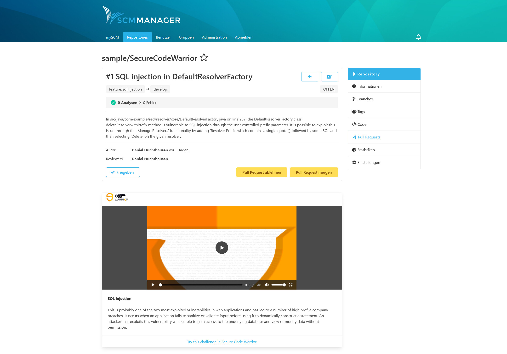
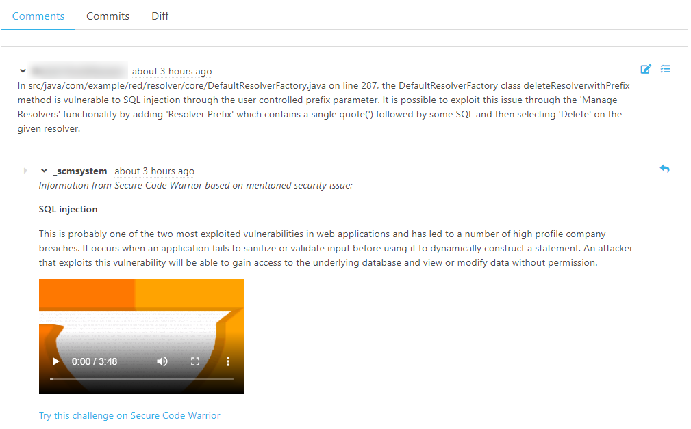
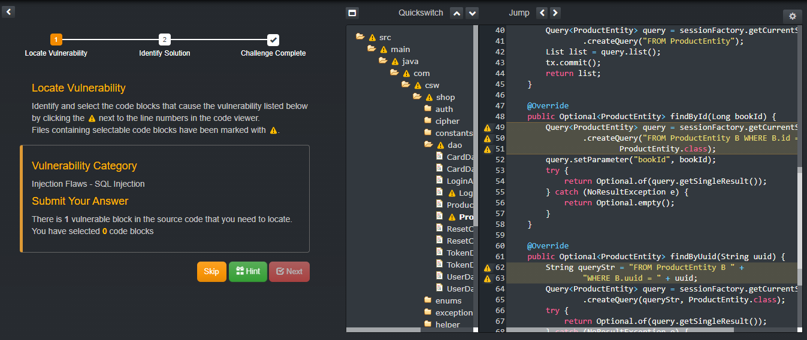

Once the plugin is installed, the plugin is ready to show you videos and additional information about security topics. There are two different ways you can use it:

* mention security issue related keywords in the description of pull requests or
* mention security issues as a reviewer of a pull request.

### Use in pull request descriptions

If you know that your application is vulnerable to a certain security issue, you can create a pull request to address the issue. 
In the description you only have to mention the name of the vulnerability. As soon as the PR is created, it also contains a video, some details and a link to additional information about the issue.

With all this information, every developer has everything they need to work on the issue.

### Use in pull request comments

Another scenario is that a reviewer of a pull request finds or suspects a vulnerability and posts a comment in the pull request. 
Then the plugin provides the details in an additional comment.

This way the developer gets all the information that is needed to address the issue so that the pull request can be accepted.

### Challenges

To get a better understanding of the issue at hand, there is always a link to challenges right under the video and description for the security topic. 
It leads to challenges on the Secure Code Warrior website. They provide a hands-on example for a sample application.

### Available topics

To determine which security issues are displayed, the plugin uses a list of keywords. 
Whenever a PR description or content of a comment matches one of the words, the corresponding information is shown. 
If keywords for more than one topic matches, several videos, details and links are displayed.

Just to show you how many topics are covered, take a look at this:

* Insecure Data Storage
* Sensitive Data Storage
* Server-side Request Forgery
* Extraneous Functionality
* Code Tampering
* Client Code Quality
* Improper Platform Usage
* Lack of Binary Protections
* Insufficient Transport Layer Protection
* Client Side Injection
* Broken Cryptography
* Vulnerable Components
* Insufficient Logging & Monitoring
* Side Channel Vulnerability
* Information Exposure
* Unintended Data Leakage
* Unvalidated Redirects & Forwards
* Memory Corruption
* Injection Flaws
* File Upload Vulnerability
* Denial of Service (DoS)
* Insecure Authorization
* Insecure Authentication
* Improper Session Handling
* Session Handling
* Cross-site Request Forgery
* Authentication
* Security Misconfiguration
* Insecure Cryptography
* Business Logic
* Cross-Site Scripting (XSS)
* Access Control
